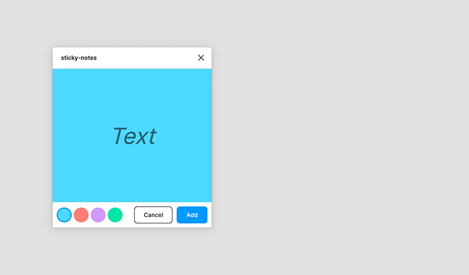
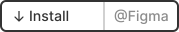

A simple sticky notes tool for Figma. Features a Vue frontend and Typescript.

## ✨ Usage

1. Go to _Plugins > Sticky Notes_
1. Enter some text 📜
1. Choose a color 🎨
1. 🟦🖐️

## 🔧 Development

1. `npm install` — Install dependencies
1. `npm run watch` — Serve the plugin (serves the frontend to `/ui/`) 🚧
1. `npm run build` — Bundle the plugin for production using Vue-CLI 🚀

## 💭 Motivation

This micro plugin is a small coffee break project to take a peek into Figma plugin development. In our team we were sometimes missing sticky notes to annotate things when presenting a canvas. Since the commenting feature wasn't visual enough and duplicating the same sticky note template across projects was annoying -- I've created this small plugin.

## 🌀 Misc

This plugin has modified [figma-plugin-ds](https://github.com/thomas-lowry/figma-plugin-ds) stylesheets included.

## 📝 License

[MIT](LICENSE)
