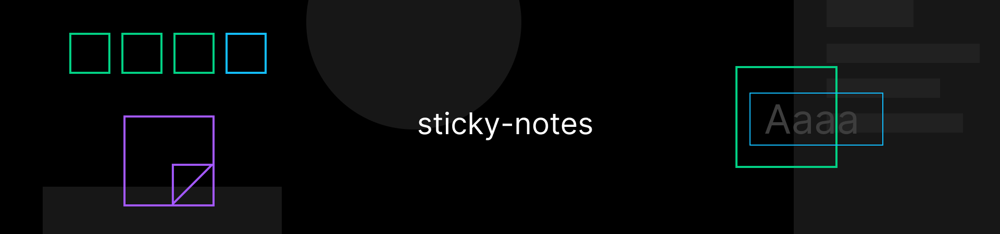

A simple sticky notes tool for Figma. Features a Vue frontend and TypeScript.

## ✨ Usage

1. Go to _Plugins > Sticky Notes_
1. Enter some text and place the note, optionally choose a desired sticky note color.

## 🔧 Development

1. `npm install` — Install dependencies
1. `npm run serve` — Build & serve the plugin for development 🚧
1. `npm run build` — Bundle the plugin for production 🚀

## 💭 Motivation

This micro plugin is a small coffee break project to take a peek at Figma plugin development. When presenting a Figma canvas during lecture I was sometimes missing a sticky note tool to make quick remarks hence I created this plugin.

## 📝 License

[MIT](LICENSE)
